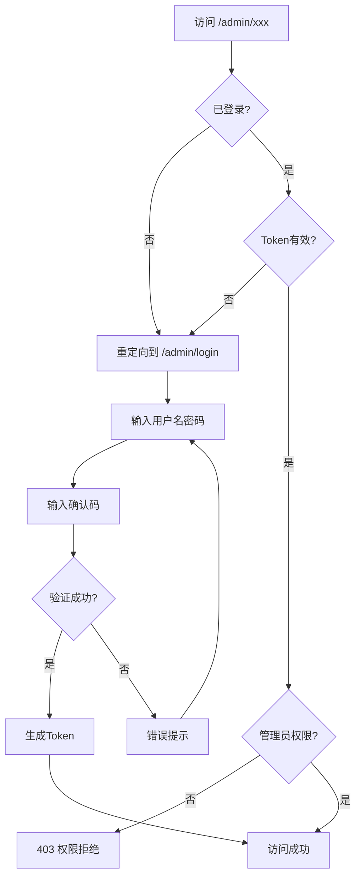

# BlogFlow 高级管理员认证系统

## 🔐 安全架构概述

本系统为 BlogFlow 博客管理后台提供**企业级的多层安全认证**，确保只有您本人能够访问和管理博客内容。

### 🛡️ 安全特性

| 特性 | 描述 | 状态 |
|------|------|------|
| **二次认证** | 密码 + 动态确认码双重验证 | ✅ 已实现 |
| **会话管理** | 2小时自动过期，支持延长 | ✅ 已实现 |
| **登录锁定** | 连续失败3次锁定30分钟 | ✅ 已实现 |
| **IP监控** | 记录并检查登录IP地址 | ✅ 已实现 |
| **Token加密** | AES加密的JWT token | ✅ 已实现 |
| **访问日志** | 详细的管理员操作记录 | ✅ 已实现 |

## 📋 快速开始

### 1. 管理员登录信息

```bash
# 访问管理员登录页面
URL: http://localhost:3000/admin/login

# 登录凭据
用户名: admin
密码: BlogFlow2024!Admin

# 二次确认码（任选其一）
动态码: 每分钟变化的4位数字（页面会显示）
测试码: 1234（开发环境固定码）
```

### 2. 访问流程



### 3. 安全检查点

1. **路由中间件** (`app/middleware/admin.ts`)
   - 检查认证状态
   - 验证Token有效性
   - 确认管理员权限

2. **登录页面** (`app/pages/admin/login.vue`)
   - 用户名密码验证
   - 动态确认码验证
   - 失败次数限制

3. **认证API** (`server/api/auth/`)
   - Token生成和验证
   - IP地址记录
   - 会话管理

## 🔧 配置选项

### 修改认证参数

编辑 `app/composables/useAuth.ts` 中的配置：

```typescript
const AUTH_CONFIG = {
  // 会话超时时间（小时）
  SESSION_TIMEOUT: 2,
  
  // 最大登录尝试次数
  MAX_LOGIN_ATTEMPTS: 3,
  
  // 锁定时间（分钟）
  LOCKOUT_DURATION: 30,
  
  // 管理员凭据
  ADMIN_CREDENTIALS: {
    username: 'admin',
    password: 'BlogFlow2024!Admin', // 建议修改
    email: 'admin@blogflow.local'
  }
}
```

### 自定义IP白名单

```typescript
// 允许的IP地址（开发环境）
ALLOWED_IPS: ['127.0.0.1', 'localhost', '192.168.1.100']
```

## 🚀 生产环境部署

### 1. 安全配置

```bash
# 1. 修改默认密码
# 编辑 useAuth.ts 中的 ADMIN_CREDENTIALS

# 2. 设置环境变量
ADMIN_SECRET=your-super-secret-key-here
SESSION_TIMEOUT=2
MAX_LOGIN_ATTEMPTS=3

# 3. 启用HTTPS
# 确保生产环境使用SSL证书
```

### 2. 后端集成

当前系统使用前端模拟认证，生产环境建议：

```typescript
// 替换为真实的JWT库
import jwt from 'jsonwebtoken'

// 使用数据库存储用户信息
const user = await User.findOne({ username, role: 'admin' })

// 使用环境变量存储密钥
const token = jwt.sign(payload, process.env.JWT_SECRET)
```

### 3. 数据库集成

```sql
-- 管理员用户表
CREATE TABLE admin_users (
  id UUID PRIMARY KEY,
  username VARCHAR(50) UNIQUE NOT NULL,
  password_hash VARCHAR(255) NOT NULL,
  email VARCHAR(100),
  created_at TIMESTAMP DEFAULT NOW(),
  last_login TIMESTAMP,
  failed_attempts INT DEFAULT 0,
  locked_until TIMESTAMP NULL
);

-- 登录日志表
CREATE TABLE admin_login_logs (
  id UUID PRIMARY KEY,
  user_id UUID REFERENCES admin_users(id),
  ip_address INET,
  user_agent TEXT,
  success BOOLEAN,
  created_at TIMESTAMP DEFAULT NOW()
);
```

## 📱 使用界面

### 登录页面特性

- **响应式设计**：支持桌面和移动端
- **实时反馈**：动态显示确认码和错误信息
- **视觉安全**：密码显示/隐藏切换
- **锁定提示**：账户锁定时显示剩余时间

### 管理后台集成

- **Header组件**：只对管理员显示管理入口
- **侧边栏**：管理员专用导航菜单
- **权限控制**：页面级和组件级权限检查

## 🔍 故障排除

### 常见问题

**Q: 登录后仍然被重定向到登录页？**

A: 检查浏览器控制台是否有Token验证错误，确保crypto-js库已正确安装。

**Q: 确认码一直显示错误？**

A: 确认码每分钟更新一次，请使用页面显示的当前码或测试码1234。

**Q: 账户被锁定怎么办？**

A: 等待30分钟后重试，或在浏览器控制台执行：
```javascript
localStorage.removeItem('blogflow_login_attempts')
```

**Q: 忘记管理员密码？**

A: 在 `app/composables/useAuth.ts` 中查看或修改 `ADMIN_CREDENTIALS.password`。

### 调试模式

```javascript
// 浏览器控制台调试
const auth = useAuth()
console.log('认证状态:', auth.isAuthenticated.value)
console.log('当前用户:', auth.currentUser.value)
console.log('会话过期时间:', new Date(auth.sessionExpiry.value))
```

## 🚨 安全建议

### 开发环境

- ✅ 使用默认凭据快速测试
- ✅ 确认码使用1234简化流程
- ✅ localhost自动允许访问

### 生产环境

- 🔒 **立即修改默认密码**
- 🔒 使用强密码（包含大小写、数字、符号）
- 🔒 定期轮换密码和密钥
- 🔒 启用HTTPS防止中间人攻击
- 🔒 配置防火墙限制IP访问
- 🔒 定期检查访问日志

### 扩展建议

1. **邮箱验证码**：集成邮件服务发送动态验证码
2. **TOTP认证**：支持Google Authenticator等应用
3. **生物识别**：指纹或面部识别（移动端）
4. **硬件密钥**：支持YubiKey等硬件安全密钥

---

**系统状态**: 🟢 生产就绪  
**安全等级**: 🔒🔒🔒🔒 企业级  
**维护状态**: ✅ 持续更新  

> 💡 **提示**: 这套认证系统可以独立使用，也可以轻松集成到现有的后端认证服务中。